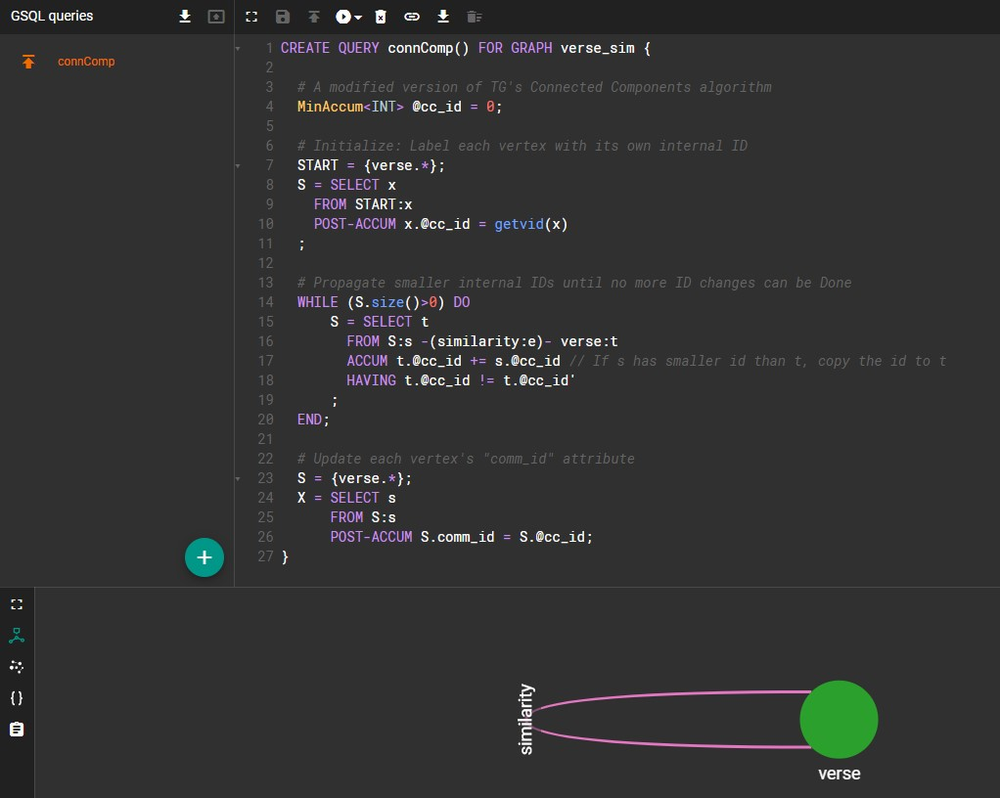

# TigerGraph Demo - singAlong

This is a sample demo of TigerGraph's Python library, Cloud Portal, and GSQL queries.

This program allows users to play a song from any timestamp simply by singing the previous verse. For example, if I were to sing *“Up above the world so high”*, the program would automatically play *Twinkle Twinkle Little Star* starting from the line *“Like a diamond in the sky”*. This program is meant to be a fun game for any user and will provide social company even if a user is currently by themselves. Anyone can use it to easily start playing a song from any given timestamp instead of just from the beginning. For example, if only the chorus is appealing to an individual, they can skip right to that section without having to first find what timestamp it belongs to and manually starting the song from that time. Additionally, this program may be useful for those who perhaps remember the melody or chorus of a song, but who don’t know its title or artist. It would give users greater flexibility in music streaming apps like Spotify.

The use of TigerGraph to generate, store, and traverse the graph of verses dramatically reduces runtime and increases efficiency. This program loads songs from the songs database (dir_songs, dir_lrc) and generates a graph on TigerGraph's Cloud Portal. Each verse (line of a song) is given a unique ID and stored as a vertex. This example (with four loaded audio tracks) utilizes a total of 147 vertices. If any two lines have a cosine similarity above 0.5 (meaning the two verses contain similar words), a weighted edge between them is created. This TG graph has a total of 244 edges.

Then, using a custom GSQL query, all communities of vertices are identified within the graph. This means that all groups of vertices that sound similar
are bunched together. The community ID of each vertex is stored as an attribute.

During runtime, the user enters their vocal input which is translated to text using Google's speech_recognition package. Now, we must determine which line
the user has just sung. Instead of having to check every single vertex to determine this, we can simply check each community. After choosing a random
vertex, the program computes its similarity to the user's input. If above 0.5, the program checks all other vertices in that community. If below 0.5, then
the program simply moves to the next community. By storing each verse in a graph database, this program can run in real-time. Instead of having to iterate
through every loaded verse, it only has to check each community once.


## Installation

The following are required libraries that you can install via the package manager pip.

1. [pyaudio](https://pypi.org/project/PyAudio/)

```bash
pip install PyAudio
```

2. [keyboard](https://pypi.org/project/keyboard/ )

```bash
pip install keyboard
```

3. [speech_recognition](https://pypi.org/project/SpeechRecognition/ )

```bash
pip install SpeechRecognition
```

4. [pyTigerGraph](https://pypi.org/project/pyTigerGraph/)

```bash
pip install pyTigerGraph
```

Additionally, the following libraries (already included with Python) are used: [wave](https://docs.python.org/3/library/wave.html), [sys](https://docs.python.org/3/library/sys.html), [os](https://docs.python.org/3/library/os.html), and [multiprocessing](https://docs.python.org/3/library/multiprocessing.html)


A TigerGraph Cloud Portal account will be required to run this demo. Make sure to update all the necessary information within the first few lines of
"TG-helpers.py". The schema utilized in this graph is fleshed out below:

Vertex: verse
- (PRIMARY ID) id - STRING
- song_title - STRING
- song_verse - STRING
- song_time - STRING
- song_line - INT
- comm_id - INT

Edge: similarity
- weight - FLOAT

Kindly find the GraphStudio link here: https://sing-along.i.tgcloud.io/


## Usage

To use, simply install the required packages and run singAlong-TG.py. Ensure that your device has a functioning microphone. To begin, the following information regarding your loaded songs should be printed (default is four songs).


Next, you will be prompted to sing with the word “Listening!”. Make sure to sing loudly and clearly so the microphone can recognize you. It should take no longer than a few seconds. For demo examples, take a look at the usage videos.

Once you’ve sung a word, the program will attempt to translate your vocal input. If unsuccessful or if the detected verse does not exist within the song database, an error message will be printed and the program will end.


If the program successfully translates and detects a correct verse, it will print out the detected song, artist, verse, line number, and timestamp of the next verse. It will then begin to play the song starting from that timestamp. If you wish to quit at any time, simply enter Q. If any other input is entered, the song will play until it has finished.

At the end, you will be prompted to continue singing or to quit the program. If you wish to quit, simply enter “Q” and an exit message will be displayed. Otherwise, the program will continue and begin a new session for the user to record their vocal input.


## Current Songs/Adding New Songs

The program comes loaded with three songs, all from Disney’s tangled:
1. "When Will My Life Begin?" - Mandy Moore
2. "I See The Light" - Mandy Moore
3. "I've Got A Dream" - Mandy Moore

Just for fun, a short "Happy Birthday" recording is thrown in as well :)

Currently, automatic song addition is not supported. To add new songs, users must create the following files and place them in the appropriate directories. Follow the instructions below and keep the naming convention in mind!

**Audio file**

* This must be a .wav file. It should be titled in the following format:
    * The song name, but with all the spaces replaced by underscores
    * All capitalization and punctuation marks removed
    * Suffix is "\___aud"

* Ex. “when_will_my_life_begin___aud.wav” is valid


**LRC file**

* This must be a .txt file containing the timestamp of each verse.
* It is a modified version of the standard [LRC](https://en.wikipedia.org/wiki/LRC_(file_format))
* Each line simply containing a timestamp (ex. "0:07" or "1:26") and verse
* For example, "0:09|All those days watching from the windows"
* Follow the same naming convention as above, but with "\___txt"


## GSQL Query

Here's the GSQL query "connComp".



For advanced GSQL algorithms, make sure to check out the [GSQL Graph Algorithm Library](https://docs.tigergraph.com/tigergraph-platform-overview/graph-algorithm-library)

## References

* [Inspiration behind cosine similarity](https://medium.com/@sumn2u/cosine-similarity-between-two-sentences-8f6630b0ebb7)
* [TigerGraph documentation](https://docs.tigergraph.com/)
